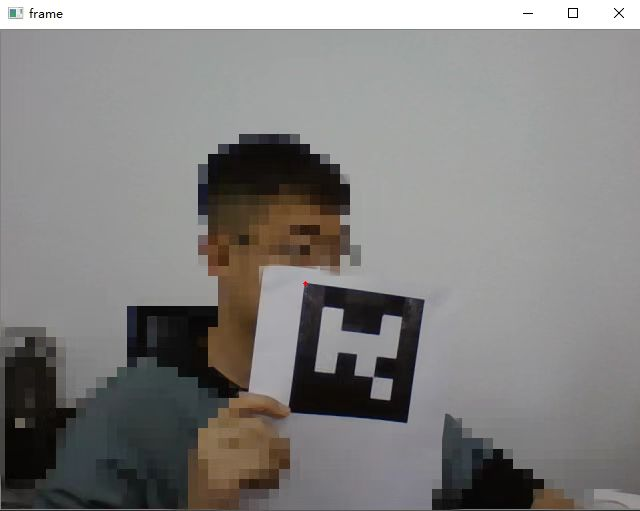
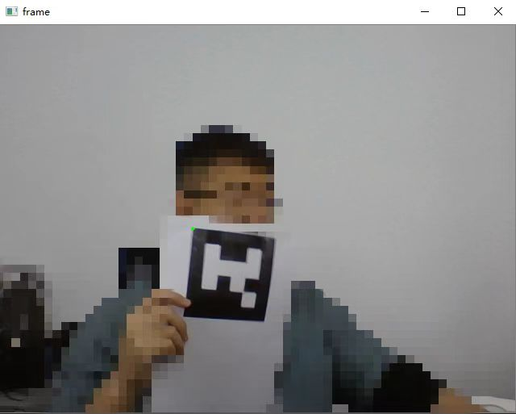

# aruco-marker-detection-no-lost-frame
## Here is a simple demo for Opencv Arcuco Marker detection
Due to the official aruco marker video detection is always losing frame, so we tend to use optical flow to avoid this phenomenon.  
ArucoMakerDetection.py will record from the first frame detecting the Aruco Marker, you can test the real time detection and the result will be saved as ./result.mp4.  
You can alse use the /ArucoMaker3D/stereoCamVideo.py to generate the coordinate in world coordinate system.  
## Attention
You need to change the /ArucoMaker3D/camconfig.py with your two camera parameters, including the R. T. and the Intrinsics.  
You need to make sure that two cameras have same Intrinsics.  
## Renderings
```
Above image is the official Opencv detection (Red Point)
Below image is the optical detection (Green Point)
```


## Contact us
```
ligaoqi02@gmail.com
```
## Acknowledgement
```
My master bro HP zhu.
```
